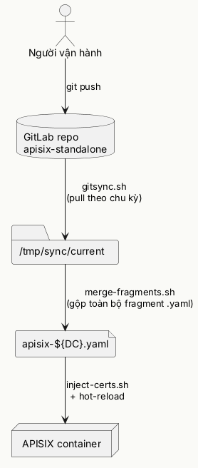

# Runbook vận hành — APISIX Standalone (Cloudian S3 Gateway)

> Tài liệu này viết cho người vận hành trực tiếp (LLD) — mỗi mục nêu rõ **sửa file nào, sửa dòng gì, khi nào cần sửa, verify bằng lệnh gì**. Dựa trên `note-kỹ-thuật-apisix.md` (ghi lại toàn bộ lịch sử điều tra/quyết định) và source code thật trong repo `apisix-standalone`. Chỗ nào note kỹ thuật chưa nói rõ, runbook này giải thích đầy đủ thêm — có đánh dấu `[BỔ SUNG]`.

---

## Mục lục

0. [Kiến trúc tổng quan — GitOps flow](#0-kiến-trúc-tổng-quan--gitops-flow)
1. [Vòng đời 1 thay đổi cấu hình](#1-vòng-đời-1-thay-đổi-cấu-hình)
2. [Thêm hoặc sửa 1 Route](#2-thêm-hoặc-sửa-1-route)
3. [Vận hành QoS / Rate-limit](#3-vận-hành-qos--rate-limit)
4. [Quyết định Local vs Redis cho 1 rule mới](#4-quyết-định-local-vs-redis-cho-1-rule-mới)
5. [Log & Observability](#5-log--observability)
6. [Healthcheck upstream](#6-healthcheck-upstream)
7. [Deploy / Upgrade version APISIX](#7-deploy--upgrade-version-apisix)
8. [Bộ công cụ debug — dùng cái nào khi nào](#8-bộ-công-cụ-debug--dùng-cái-nào-khi-nào)
9. [Checklist trước khi đẩy production](#9-checklist-trước-khi-đẩy-production)
10. [Xử lý sự cố thường gặp — triệu chứng → nơi sửa → cách verify](#10-xử-lý-sự-cố-thường-gặp--triệu-chứng--nơi-sửa--cách-verify)

---

## 0. Kiến trúc tổng quan — GitOps flow

Toàn bộ cấu hình sống trong Git — **không sửa trực tiếp trong container**. Container tự đồng bộ theo chu kỳ cố định qua `gitsync.sh`.

### Sơ đồ ASCII (bắt buộc có sẵn để review)

```
┌──────────────┐     git push      ┌─────────────────┐
│  Người vận    │ ────────────────▶│   GitLab repo    │
│  hành (bạn)   │                   │ apisix-standalone│
└──────────────┘                   └────────┬─────────┘
                                             │ (gitsync container clone/pull)
                                             │ chu kỳ cố định — xem
                                             │ scripts/runtime/gitsync.sh
                                             ▼
                                   ┌───────────────────┐
                                   │  /tmp/sync/current │  (working copy)
                                   └────────┬───────────┘
                                            │ merge-fragments.sh
                                            │ (gộp toàn bộ .yaml rời rạc
                                            │  thành 1 file config lớn)
                                            ▼
                                   ┌───────────────────┐
                                   │ apisix-${DC}.yaml  │
                                   │ (file config cuối) │
                                   └────────┬───────────┘
                                            │ inject-certs.sh
                                            │ (chèn cert đã giải mã)
                                            ▼
                                   ┌───────────────────┐
                                   │  APISIX container  │
                                   │  (đọc file, reload) │
                                   └────────────────────┘
```

### Sơ đồ PlantUML (tương đương, để render hình nếu cần)



**[BỔ SUNG]** — 2 script lõi cần nhớ tên, nằm ở `scripts/runtime/`:
- `gitsync.sh` — vòng lặp chính, có cơ chế **lock** (`/tmp/.gitsync.lock`) để tránh 2 lần chạy chồng nhau nếu lần trước chưa xong khi tới chu kỳ tiếp theo — quan trọng khi debug "sao sửa xong chưa thấy áp dụng", luôn kiểm tra lock trước khi nghi ngờ gì khác.
- `merge-fragments.sh` — validate **bắt buộc** phải có đủ 4 thư mục core: `upstreams/`, `routes/`, `services/`, `ssls/` (thiếu 1 trong 4 → hard error, dừng hẳn, không merge). Các thư mục còn lại (`consumers/`, `consumer_groups/`, `plugin_configs/`, `global_rules/`, `plugin_metadata/`) là **tuỳ chọn** — thiếu chỉ log INFO, không lỗi.

### Cấu trúc thư mục repo (map nhanh — sửa gì tìm ở đâu)

| Thư mục | Chứa gì | Sửa khi nào |
|---|---|---|
| `apisix_config/` | `config-hcm.yaml`, `config-han.yaml` — cấu hình gốc APISIX (danh sách plugin enable, `worker_rlimit_nofile`, `nginx_config`...) | Đổi version, bật/tắt plugin toàn cục, tune OS-level |
| `apisix_routes/routes/hyperstore-cloudian/` | 1 file YAML = 1 domain (S3, IAM, STS, CMC, HyperIQ, SQS, S3-Admin) | Thêm domain mới, đổi routing logic |
| `apisix_routes/upstreams/` | Danh sách node vật lý (IP:port) từng service | Đổi node Cloudian, đổi port backend |
| `apisix_routes/services/` | Gộp plugin dùng chung cho nhiều route | Ít khi sửa |
| `apisix_routes/consumer_groups/` | 8 group QoS cố định (`tier1-4`, `boost`, `lockdown`, `incident`, `event`) | Đổi ngưỡng rate-limit theo nhóm |
| `apisix_routes/consumers/` | 3 file theo loại identity (`bucketname`, `snatip`, `bucketsnat`) | Đăng ký bucket/IP cần policy riêng |
| `apisix_routes/plugin_configs/` | `qos-auth`, `qos-internal-console`, `traffic-classifier` — bó plugin dùng chung theo nhóm route | Đổi rule QoS áp dụng theo route |
| `apisix_routes/global_rules/` | Áp cho **mọi route** không ngoại lệ (`global-abuse-guard`, `global-kafka-logger`...) | Thay đổi có tác động toàn hệ thống |
| `apisix_routes/plugin_metadata/` | Cấu hình runtime cho plugin custom (`log-level.yaml`, `s3-traffic-classifier-snatip.yaml`) | Đổi log level, đổi danh sách SNAT CIDR |
| `plugins/custom/` | Code Lua tự viết (`s3-qos-consumer.lua`, `s3-traffic-classifier.lua`...) | Đổi logic — cần build lại image, KHÔNG hot-reload |
| `scripts/deploy/` | Chạy 1 lần lúc setup/upgrade version | Patch template, mã hoá cert |
| `scripts/runtime/` | Chạy liên tục trong container (gitsync, merge, inject cert) | Không tự sửa trừ khi đổi cơ chế GitOps |
| `scripts/debug/` | Công cụ chẩn đoán, chạy tay khi cần | Xem [Mục 8](#8-bộ-công-cụ-debug--dùng-cái-nào-khi-nào) |

---

## 1. Vòng đời 1 thay đổi cấu hình

Áp dụng cho **mọi** thay đổi thuộc nhóm "hot-reload" (route, consumer, consumer_group, plugin_config, upstream, service, ssl, plugin_metadata) — **không áp dụng** cho thay đổi code Lua (`plugins/custom/`) hay `apisix_config/*.yaml` (2 loại này cần restart container, xem [Mục 7](#7-deploy--upgrade-version-apisix)).

| Bước | Việc làm | Lệnh / thao tác |
|---|---|---|
| 1 | Sửa đúng file `.yaml` fragment trong repo (không sửa file merge cuối cùng trong container) | Sửa trực tiếp qua editor/IDE |
| 2 | Kiểm tra cú pháp YAML hợp lệ trước khi commit | `yamllint <file>` hoặc mở bằng trình duyệt code có lint |
| 3 | Commit + push lên nhánh chính | `git add . && git commit -m "..." && git push` |
| 4 | Chờ `gitsync.sh` tự chạy — **≤30s** theo chu kỳ đã note | Không cần thao tác gì thêm |
| 5 | Verify config đã merge đúng, không lỗi | `docker logs gitsync --tail 20` — tìm dòng `[merge-fragments] ERROR` nếu có |
| 6 | Verify runtime — config đã thật sự load vào APISIX, không chỉ merge xong | `scripts/debug/verify-apisix.sh` (xem [Mục 8](#8-bộ-công-cụ-debug--dùng-cái-nào-khi-nào)) |
| 7 | Verify hành vi thật bằng traffic — không tin chỉ vì "không có lỗi" | `curl`/`scripts/debug/curl-route.sh` đúng route vừa sửa |

**[BỔ SUNG] — lỗi thường gặp nhất khi bỏ qua bước 5**: nếu file mới có lỗi schema (VD thiếu field bắt buộc, sai kiểu dữ liệu), APISIX **từ chối load toàn bộ phần liên quan** (không chỉ riêng file lỗi) — đã gặp thật với lỗi `group conf mismatched` (2 nơi cùng dùng `limit-count.group` nhưng khác tham số) khiến **cả `consumer_groups`** ngừng hoạt động, ảnh hưởng dây chuyền sang mọi Consumer đang gán vào bất kỳ group nào, không chỉ group bị lỗi. Luôn đọc kỹ `docker logs gitsync` sau mỗi lần push.

---

## 2. Thêm hoặc sửa 1 Route

### 2.1 — Câu hỏi đầu tiên: route này có cần tách theo port không

```
┌─────────────────────────────────────────────┐
│ Domain mới có cần phục vụ NHIỀU port cùng lúc?│
└───────────────┬───────────────────┬──────────┘
                │ Không              │ Có
                ▼                    ▼
        1 route duy nhất      Port APISIX-facing có
        (VD: s3-hcm, cmc,     TRÙNG port vật lý
        hyperiq, sqs)         Cloudian thật không?
                                  │           │
                              Trùng          Khác
                              (VD S3)      (VD IAM/STS:
                                │          route 443+16443
                                ▼          → cùng 1 backend
                          Không cần         16443 vật lý)
                          X-Forwarded-Port      │
                                                 ▼
                                        Tách 2 route con
                                        (vars: server_port),
                                        route KHÁC port vật lý
                                        PHẢI có X-Forwarded-Port
```

**[BỔ SUNG]** — đây chính là bài học rút ra từ case IAM/STS: Cloudian đối chiếu 2 nguồn tin trước khi xử lý request SigV4 —

- **A** = port mà Jetty (HTTP server nhúng trong Cloudian) tự nhận mình đang phục vụ. Không có `X-Forwarded-Port` → A = port socket vật lý thật. Có `X-Forwarded-Port` → A bị ghi đè theo giá trị header.
- **B** = port mà client khai trong `Host:` header (có ghi số thì lấy số, không ghi thì ngầm hiểu theo port mặc định của scheme — 443 cho https).
- **A ≠ B → Cloudian từ chối ngay (`400 InvalidAction`), chưa kịp verify chữ ký. A = B → xử lý bình thường.**

→ Route nào có port APISIX-facing khác port Cloudian vật lý thật (ép do 1 domain phục vụ nhiều port nhưng backend chỉ có 1 port) — **bắt buộc** thêm:
```yaml
proxy-rewrite:
  headers:
    set:
      X-Forwarded-Port: "$server_port"
```
Route nào KHÔNG lệch port (S3-hcm/hni, CMC, HyperIQ, SQS — kiểm tra: `port` trong file `apisix_routes/upstreams/upstream-<tên>.yaml` phải **trùng đúng** với port route đang match) — **không cần** dòng này, thêm vào chỉ thừa, không gây hại nhưng không có tác dụng.

**Ngoại lệ**: route dùng **Basic Auth** (không phải SigV4 — VD S3-Admin) không đi qua cơ chế đối chiếu A/B này, dù có lệch port cũng không cần `X-Forwarded-Port`. Kiểm tra nhanh: mở DevTools lúc gọi thật, xem header `Authorization` là `Basic ...` hay `AWS4-HMAC-SHA256 ...`.

### 2.2 — Checklist tạo file route mới

1. Copy 1 route tương tự đã có làm mẫu (VD route SigV4 1-port → copy `route-s3-hni...yaml`; route SigV4 2-port → copy `route-sts...yaml`).
2. Đổi `id`, `host`, `service_id` (trỏ đúng `service-upstream-<tên>` đã tạo trước, hoặc tạo mới trong `apisix_routes/services/`).
3. Tạo file upstream tương ứng trong `apisix_routes/upstreams/upstream-<tên>.sds.infiniband.vn.yaml` — xác nhận đúng `port:` vật lý thật (hỏi phía Cloudian/hạ tầng, không đoán).
4. Áp dụng đúng nhánh sơ đồ 2.1 — quyết định có cần `X-Forwarded-Port` không.
5. Gán `plugin_config_id` phù hợp (dùng lại `qos-auth` nếu là SigV4 service; `qos-internal-console` nếu Basic Auth/console nội bộ).
6. Theo [Mục 1](#1-vòng-đời-1-thay-đổi-cấu-hình) — commit, verify, test traffic thật.
7. Test tối thiểu 1 request với **port mặc định** (client không ghi port) và 1 request **ghi rõ port** — 2 case phải cho cùng 1 loại kết quả (cùng qua được dispatch, dù sau đó thành công hay lỗi do lý do khác).

---

## 3. Vận hành QoS / Rate-limit

**[BỔ SUNG]** — Toàn bộ hệ thống QoS chia làm **2 tầng độc lập, chạy tuần tự**, dễ nhầm nếu không phân biệt rõ:

| | **Dynamic QoS** (Layer 2) | **Static QoS** (Layer 3) |
|---|---|---|
| Chạy ở đâu | `plugins/custom/s3-traffic-classifier.lua` | `plugins/custom/s3-qos-consumer.lua` + `consumer_groups/`, `consumers/` |
| Quyết định dựa trên | Tín hiệu tự khai trong **chính request đó** (có AKID không, IP có trong dải SNAT không, có bucket trong URL không) — tính lại **mỗi request**, không cần đăng ký trước | Danh sách **admin đã đăng ký sẵn** (bucket/IP cụ thể nào cần policy riêng) — tra cứu, không tính toán |
| Áp dụng cho | **Mọi** request đi qua route S3 — kể cả bucket/IP chưa từng biết tới | Chỉ áp cho object đã có tên **trong danh sách** — object khác rơi về baseline của tầng Dynamic |
| Sửa ở đâu khi cần đổi | `plugin-config-traffic-classifier.yaml` (ngưỡng), `plugin_metadata/s3-traffic-classifier-snatip.yaml` (danh sách SNAT) | `consumer_groups/*.yaml`, `consumers/*.yaml` |
| Thứ tự chạy | **Trước** — priority `9000` | **Sau** — priority `9500` (dispatch Consumer chạy trước, nhưng nếu không có Consumer nào khớp thì Dynamic QoS ở Layer 2 vẫn là nơi quyết định ngưỡng cuối) |

Nói ngắn gọn: **Dynamic QoS = luật chung, tự động phân loại theo hành vi**. **Static QoS = ngoại lệ đã biết trước, tra bảng**. 1 request luôn đi qua Dynamic QoS; chỉ đi thêm qua Static QoS nếu nó trùng khớp 1 entry đã đăng ký.

### 3.1 — Dynamic QoS: logic phân loại K > S > Anon

📊 [Xem cây quyết định trực quan (HTML) — có highlight key/header từng nhánh](./runbook-qos-decision-tree.html)


`s3-traffic-classifier.lua` xét 3 tín hiệu độc lập trên mỗi request:

| Tín hiệu | Ký hiệu | Đọc từ đâu |
|---|---|---|
| Có bucket trong URL | **B** | `ctx.s3_bucket_name` (do `s3-normalizer-bucket-name.lua` export, chạy trước) |
| Có AKID hợp lệ về cú pháp | **K** | Header `Authorization`/query string, qua `plugins/libraries/s3-akid-utils.lua` |
| IP thuộc dải SNAT nội bộ | **S** | `ctx.var.remote_addr` so với `plugin_metadata/s3-traffic-classifier-snatip.yaml` |

**Bảng đôi — vote theo từng cặp biến** (mỗi cặp 4 tổ hợp, "2/3 phiếu đồng thuận" giải được 6/8 tổ hợp B×K×S):

| B | K | Vote (BK) | B | S | Vote (BS) | K | S | Vote (KS) |
|---|---|---|---|---|---|---|---|---|
| 1 | 1 | Authen | 1 | 1 | SNAT | 1 | 1 | *chưa xác định* |
| 1 | 0 | *chưa xác định* | 1 | 0 | *chưa xác định* | 1 | 0 | Authen |
| 0 | 1 | *chưa xác định* | 0 | 1 | SNAT | 0 | 1 | SNAT |
| 0 | 0 | Anonymous | 0 | 0 | Anonymous | 0 | 0 | Anonymous |

Còn đúng **2 tổ hợp hoà phiếu** không giải được bằng vote đa số: `B=1,K=1,S=1` và `B=0,K=1,S=0` — đây là 2 chỗ luật `K > S > Anon` phát huy tác dụng thật sự (không phải quy tắc thừa).

**Bảng ba — bảng chân trị đầy đủ 8 lá B×K×S, quyết định cuối:**

| B | K | S | Vote | Quyết định cuối | Header key ở Layer 2 | Ví dụ thực tế |
|---|---|---|---|---|---|---|
| 1 | 1 | 0 | Authen (2 phiếu) | **Authenticated** | `X-S3-Bucket-Name` | `aws s3 cp` tới bucket, IP thường |
| 1 | 1 | 1 | ⚠️ Hoà | **Authenticated** | `X-S3-Bucket-Name` | Ký đúng, IP lại thuộc dải SNAT — K thắng, không gộp vào pool SNAT |
| 1 | 0 | 1 | SNAT (2 phiếu) | **SNAT** | `X-SNAT` / `X-SNAT-Ip` | `curl` không ký, IP dải SNAT |
| 1 | 0 | 0 | Anon (1 phiếu) | **Anonymous** | `X-Real-Ip` | `curl` không ký `GET /<bucket-công-khai>/` — case gốc phát hiện lỗ hổng |
| 0 | 1 | 0 | ⚠️ Hoà | **Authenticated** | `X-S3-Akid-Only` | `aws s3 ls` (ListBuckets, không nhắm bucket cụ thể) |
| 0 | 1 | 1 | SNAT (1 phiếu) | **Authenticated** | `X-S3-Akid-Only` | `aws s3 ls` từ IP dải SNAT — K vẫn thắng |
| 0 | 0 | 1 | SNAT (2 phiếu) | **SNAT** | `X-SNAT` / `X-SNAT-Ip` | `curl GET /` không ký, IP dải SNAT |
| 0 | 0 | 0 | Anon (3 phiếu) | **Anonymous** | `X-Real-Ip` | `curl GET /` không ký, IP thường |

**Vì sao `K > S > Anon`, không phải `B > S > Anon`** — cả B và K đều là claim **chưa được gateway verify** (Cloudian mới verify chữ ký thật). Khác biệt nằm ở **ai chịu thiệt khi tín hiệu đó là giả**:
- Sai ở `K` (AKID bịa) → thiệt hại tự khoanh vùng vào chính request đó, không đụng ai.
- Sai ở `B` (gõ đúng tên bucket khách hàng thật, không ký) → nếu cho `B` thắng, traffic rác **cộng dồn thẳng vào quota của khách hàng thật** — lan sang bên thứ ba không liên quan, đồng thời né được toàn bộ tầng chống-lạm-dụng SNAT/Anon.

`B` không mất vai trò — chỉ đổi từ "điều kiện xếp tier" sang "điều kiện chọn key bên trong tier Authenticated" (đã có `K=1`): có bucket → dùng bucket làm key (per-bucket quota, per-bucket Consumer override); không có bucket → fallback AKID.

### 3.2 — Static QoS: 3 loại Consumer (đối tượng cần override QoS riêng)

Plugin `plugins/custom/s3-qos-consumer.lua` tự động resolve request thành 1 trong 3 loại — client không cần khai gì thêm, chỉ cần **admin đăng ký trước** trong đúng file:

| Loại | File khai | Format `username` | Khớp khi nào |
|---|---|---|---|
| Theo bucket | `apisix_routes/consumers/consumer-s3-bucketname.yaml` | `bucket-<tên-bucket>` | Đúng bucket, bất kỳ IP nào |
| Theo IP cụ thể | `apisix_routes/consumers/consumer-s3-snatip.yaml` | `snatip-<ip-đổi-chấm-thành-gạch>` | Đúng IP, bất kỳ bucket nào (IPv4 phải đổi `.`→`-`, vì `username` chỉ nhận `^[a-zA-Z0-9_\-]+$`) |
| Kết hợp cả 2 | `apisix_routes/consumers/consumer-s3-bucketsnat.yaml` | `bucketsnat-<bucket>-<ip-đổi-chấm-thành-gạch>` | ĐÚNG bucket này TỪ ĐÚNG IP này — ưu tiên cao nhất |

**Thứ tự ưu tiên khi nhiều loại cùng khớp 1 request**: `combo > bucket > snat-ip` (tín hiệu càng hẹp — càng ít đối tượng bị ảnh hưởng nếu đăng ký sai — càng ưu tiên cao).

#### Phạm vi bắt buộc của Static QoS S3 — đã verify runtime (2026-08-25)

`s3-qos-consumer` **không** là policy theo IP toàn gateway. Nó chỉ có thể
resolve Consumer trên Route có khai đúng plugin `custom.s3-qos-consumer: {}`.
Hiện tại plugin này chỉ được bind vào các S3 route; route CMC/VCR/MAAS không
khai plugin thì không gọi `consumer_mod.attach_consumer()` và không thể nhận
policy `snatip-*`, `bucket-*` hay `bucketsnat-*` của S3, dù cùng source IP.

Đã kiểm chứng từ `sb-s3-lb-1`, khi APISIX nhìn thấy `remote_addr=172.27.2.204`:

| Route | Kết quả quan sát | Kết luận |
|---|---|---|
| `s3-hcm.sds.infiniband.vn:443` | `X-Debug-Consumer-Resolved: snatip-172-27-2-204` và `X-Custom-snatip-172.27.2.204-RateLimit-*` | S3 Consumer được resolve đúng |
| `cmc.sds.infiniband.vn:8443` | Không có hai header trên, response `200` | Không bị S3 Consumer/limit ảnh hưởng |

`ctx.var.remote_addr` là source IP APISIX quan sát ở connection hiện tại. Nó
chỉ trở thành client IP từ header khi Route thực sự bind plugin `real-ip` với
`trusted_addresses` đúng; hiện config chỉ load plugin `real-ip`, chưa bind nó
ở Route/Plugin Config/Global Rule. Không dùng `snatip-*` để siết một khách
hàng nếu IP đó là NAT dùng chung; khi cần khoanh hẹp hãy dùng
`bucketsnat-<bucket>-<ip>`.

**Không suy luận sai từ header/log:**

- `X-RateLimit-Layer: 2` trên CMC là header do
  `plugin-config-qos-internal-console` tự set; CMC có `limit-conn` riêng theo
  `remote_addr` (4500 connections/IP), không phải Dynamic QoS S3.
- Access log có thể ghi `consumer:"-"` ngay cả khi S3 Consumer đã resolve.
  `global-abuse-guard` chạy `serverless-pre-function` trước plugin local và
  chốt `X-Consumer` trước khi `s3-qos-consumer` gọi `attach_consumer()`. Dùng
  `X-Debug-Consumer-Resolved` cùng header `X-Custom-...-RateLimit-*` làm bằng
  chứng quyết định cho Static QoS S3, không dùng field `consumer` hiện tại.

Khi cần kiểm chứng sau này, chỉ cần gọi cùng một gateway từ source IP đã đăng
ký vào một S3 route và một non-S3 route; không cần flood để tạo 429. Tiêu chí
pass là Consumer headers chỉ xuất hiện ở S3 route. Vẫn có thể thấy
`X-Global-RateLimit-*` ở cả hai vì `global-abuse-guard` là ceiling áp dụng cho
mọi Route.

### 3.3 — 8 Consumer Group cố định, khi nào dùng cái nào

**Trục Cấp dữ liệu** (steady-state — bucket "sống" ở đây khi bình thường):

| Group | File | Ngưỡng hiện tại | Dùng khi |
|---|---|---|---|
| `consumer-group-s3-tier4-mission-critical` | `consumer-group-s3-tiers.yaml` | 50 req/60s | Dữ liệu PCI, tài chính, pháp lý |
| `consumer-group-s3-tier3-business-critical` | (cùng file trên) | 500 req/60s | Vận hành quan trọng, ngoài PCI |
| `consumer-group-s3-tier2-standard` | (cùng file trên) | 300 req/60s | Baseline mặc định |
| `consumer-group-s3-tier1-archive` | (cùng file trên) | 1000 req/60s | Archive/public, ưu tiên cost |

**Trục xử lý vận hành** (chuyển TẠM THỜI, đổi `group_id` sang đây khi có sự kiện, trả về Trục Cấp dữ liệu khi xong):

| Group | File | Ngưỡng hiện tại | Dùng khi |
|---|---|---|---|
| `consumer-group-s3-boost` | `consumer-group-s3-boost.yaml` | 2000 req/60s | Nới tạm cho tải cao hợp lệ, biết trước (đối tác báo trước migration lớn) |
| `consumer-group-s3-lockdown` | `consumer-group-s3-lockdown.yaml` | 2 req/60s | Siết khẩn cấp, đã xác định rõ đối tượng lạm dụng |
| `consumer-group-s3-incident` | `consumer-group-s3-incident.yaml` | 20 req/60s | Đang điều tra, chưa chắc chắn siết gắt như lockdown |
| `consumer-group-s3-event` | `consumer-group-s3-event.yaml` | 800 req/60s | Sự kiện có kế hoạch, giới hạn thời gian |

> ⚠️ Toàn bộ số ngưỡng trên là **số tượng trưng** — rà lại theo dữ liệu traffic thật trước khi đưa production.

> **Header trace theo từng group (2026-08-20):** cả 8 group đều đã có `header_prefix` riêng trong `limit-count`
> (`Tier4`/`Tier3`/`Tier2`/`Tier1`/`Boost`/`Event`/`Incident`/`Lockdown`) — response trả về `X-<Prefix>-RateLimit-*`,
> không trùng tên với Tầng 1 (`X-Global-*`) hay Tầng 2 (`X-Authen-*`/`X-AkidOnly-*`/`X-Snat-Group-*`/`X-Snat-Ip-*`/`X-Anon-*`).
> Consumer nào override riêng (`consumers/*.yaml`) cũng phải tự đặt `header_prefix` không trùng — xem bẫy #4 mục 3.5.

### 3.4 — Quy trình tạo group tạm thời (incident/event cụ thể)

Dùng khi 1 case cụ thể cần ngưỡng **khác** pool chung của `incident`/`event`:

1. Copy file `consumer-group-s3-incident.yaml` (hoặc `-event.yaml`) làm mẫu.
2. Đặt tên có hậu tố: `consumer-group-s3-incident-<mã>` (VD `consumer-group-s3-incident-1545`) hoặc `consumer-group-s3-event-<tên>` (VD `consumer-group-s3-event-pay2go3`).
3. Đổi `id:` bên trong file khớp đúng tên file (bài học từ lỗi thật đã gặp — tên file và `id:` bên trong lệch nhau từng gây lỗi validate).
4. Chỉnh ngưỡng riêng cho case đó.
5. Đổi `group_id` của Consumer liên quan sang group mới này (trong `consumer-s3-*.yaml`).
6. **Khi sự kiện kết thúc**: xoá file group hậu tố này, đưa `group_id` của Consumer về lại group cố định phù hợp (thường là group Cấp dữ liệu gốc), hoặc gỡ hẳn `group_id` nếu cần giữ override riêng dài hạn.
7. Ghi lại vào changelog: ngày tạo, ngày xoá, lý do, kết quả — **không** lưu lịch sử trao đổi chưa chốt vào chính file YAML.

### 3.5 — Bẫy cần tránh khi khai `limit-count`/`limit-conn`

**[BỔ SUNG]** — 3 lỗi thật đã gặp, ghi lại để không lặp lại:

1. **`group` field (chia sẻ counter giữa nhiều plugin instance) đòi hỏi TOÀN BỘ tham số khớp tuyệt đối** — không chỉ `count`, mà cả `allow_degradation`, `show_limit_quota_header`, `rejected_code`... Thiếu dù chỉ 1 field (dùng default ngầm khác giá trị bên kia) → APISIX từ chối load, lỗi `group conf mismatched`, sập cả `consumer_groups`. **Khuyến nghị: không dùng field `group` trong vận hành thật** — chỉ nên dùng tạm để test/kiểm chứng lý thuyết, xoá ngay sau khi test xong.
2. **Prefix `custom.`** — khai plugin trong `consumers.yaml`/`consumer_groups.yaml` phải ghi đủ `custom.s3-qos-consumer: {}`, thiếu prefix bị `check_single_plugin_schema` báo "unknown plugin", Consumer coi như không gắn plugin gì.
3. **`limit-conn` với `rules:` (dùng nhiều rule độc lập trong 1 plugin_config)** — `default_conn_delay` vẫn bắt buộc khai ở **top-level** (ngoài `rules:`), và mỗi item trong `rules:` **không hỗ trợ** `header_prefix` (khác `limit-count` có hỗ trợ) — thiếu/sai 1 trong 2 điểm này khiến APISIX từ chối load toàn bộ `plugin_config`.
4. **`limit-count` không khai `header_prefix` → đè header giữa các tầng.** Mặc định (không `header_prefix`) sinh header phẳng `X-RateLimit-Limit/Remaining/Reset`. Vì `global_rules` (Tầng 1) luôn chạy **cộng dồn thêm** với plugin ở `consumer_group`/`plugin_config` (không phải merge/thay thế), nếu 2+ nơi cùng dùng `limit-count` không `header_prefix`, nơi chạy sau sẽ **ghi đè** header của nơi chạy trước — client đọc nhầm quota của tầng khác mà không có lỗi nào báo. Đã xảy ra thật: Tầng 1 (`Global`) từng bị 8 `consumer_group` ở Tầng 3 đè `X-RateLimit-Remaining` trước khi thêm `header_prefix` riêng cho từng nhóm. **Quy tắc bắt buộc: mọi `limit-count` (dù chỉ 1 rule) đều phải khai `header_prefix` riêng, không trùng bất kỳ tầng nào khác.** `limit-conn` không có rủi ro này vì bản thân plugin không xuất header quota nào (xem điểm 3).
5. **`rules[].key` không tồn tại → rule bị skip hoàn toàn, không lỗi, không log.** Nếu đổi `key` từ 1 biến luôn tồn tại (`remote_addr`) sang biến có điều kiện (`consumer_name`, chỉ có khi resolve được identity) mà không thêm rule fallback, request không resolve được sẽ **né hoàn toàn** rule đó — im lặng, không 429, không log cảnh báo. Luôn tự hỏi "biến này có thể không tồn tại không?" trước khi đổi `key`.

### 3.6 — Toàn bộ file liên quan QoS — rà ở đâu khi có sự cố hoặc cần đổi theo yêu cầu

**[BỔ SUNG]** — map đầy đủ, chia theo đúng 2 tầng Dynamic/Static đã nói ở đầu mục. Khi có sự cố hoặc yêu cầu mới, xác định trước request đó thuộc tầng nào rồi mới sửa đúng file — sửa nhầm tầng (VD sửa Consumer Group cho 1 vấn đề thực chất nằm ở Dynamic QoS) sẽ không có tác dụng.

**Tầng Dynamic QoS:**

| File | Vai trò | Sửa khi nào |
|---|---|---|
| `plugins/custom/s3-traffic-classifier.lua` | Logic chính — tính B/K/S, áp luật K>S>Anon, set header `X-S3-*`/`X-SNAT*`/`X-Real-Ip` | Đổi logic phân loại, thêm tín hiệu thứ 4 ngoài B/K/S |
| `plugins/custom/s3-normalizer-bucket-name.lua` | Export `ctx.s3_bucket_name` (tín hiệu B) — parse vhost-style/path-style, **không** verify bucket có thật | Đổi domain hỗ trợ vhost-style, đổi cú pháp bucket hợp lệ |
| `plugins/custom/s3-accesskey-extractor.lua` | Trích AKID ra header `akid` phục vụ log (khác với tín hiệu K nội bộ dùng trong classifier) | Đổi field log, đổi cách hiển thị AKID trong log |
| `plugins/libraries/s3-akid-utils.lua` | Thư viện thuần Lua — trích AKID từ 4 dạng auth (SigV4 header/streaming, SigV2, presigned URL) | Cloudian/Ceph đổi format `Authorization` hoặc thêm dạng auth mới |
| `apisix_routes/plugin_configs/plugin-config-traffic-classifier.yaml` | Ngưỡng `limit-count`/`limit-conn` cho từng nhóm (Authen/AkidOnly/Snat-Group/Snat-Ip/Anon) | Đổi số ngưỡng theo traffic thật |
| `apisix_routes/plugin_metadata/s3-traffic-classifier-snatip.yaml` | Danh sách CIDR coi là "dải SNAT nội bộ" (tín hiệu S) | Thêm/bớt dải IP nội bộ, đổi hạ tầng NAT |
| `plugins/libraries/log-level-utils.lua` | Thư viện chung cho cơ chế log 2 tầng — dùng bởi `s3-traffic-classifier.lua` và `serverless-post-function` | Đổi cơ chế filter log, thêm `field_prefix` mới ngoài `core`/`ngx` |

**Tầng Static QoS:**

| File | Vai trò | Sửa khi nào |
|---|---|---|
| `plugins/custom/s3-qos-consumer.lua` | Resolve request thành Consumer (bucket/snatip/bucketsnat), áp thứ tự ưu tiên combo>bucket>snat-ip | Đổi thứ tự ưu tiên, thêm loại identity thứ 4 |
| `apisix_routes/consumers/consumer-s3-*.yaml` (3 file) | Danh sách object đã đăng ký override riêng | Thêm/xoá bucket/IP cần policy riêng |
| `apisix_routes/consumer_groups/consumer-group-s3-*.yaml` (5 file) | 8 group cố định (tier1-4, boost, lockdown, incident, event) | Đổi ngưỡng theo nhóm, thêm group mới |

**Cả 2 tầng dùng chung:**

| File | Vai trò |
|---|---|
| `apisix_routes/routes/hyperstore-cloudian/route-s3-*.yaml` | Nơi khai thứ tự chạy plugin (`priority`) — xác nhận đúng thứ tự `s3-normalizer(10005) → s3-qos-consumer(9500) → s3-traffic-classifier(9000)` chưa bị đổi nhầm khi thêm plugin mới |

**Tầng 1 — Global (áp trước cả Dynamic/Static, không phân biệt đối tượng):**

| File | Vai trò | Sửa khi nào |
|---|---|---|
| `apisix_routes/global_rules/global-abuse-guard.yaml` | `limit-count`/`limit-conn` 1 counter DUY NHẤT cho toàn bộ node (`key: ${http_x_node_id}`, `header_prefix: "Global"`); `serverless-pre-function` set header `X-Node-Id` từ ENV `NODE_ID` | Đổi ngưỡng global (50000 req/60s, 49500 conn), đổi cơ chế set `X-Node-Id` |
| `apisix_routes/global_rules/global-request-id.yaml` | `request-id` — gắn `X-Request-Id` cho 100% request qua node, trace xuyên suốt log | Đổi tên header, đổi thuật toán sinh ID |
| `docker-compose.yaml` (service `apisix-standalone`) | ENV `NODE_ID=apisix-standalone-${DC_PROFILE}-${ORDER_NUM}` — nguồn giá trị `X-Node-Id`. **Không** dùng field `hostname:` vì xung đột với `network_mode: host` (Docker từ chối tạo container) | Đổi convention đặt tên node |

### 3.7 — Logic validate bucket name — 2 nơi kiểm tra, 1 thư viện dùng chung

**[BỔ SUNG]** — dễ nhầm vì có **2 điểm vào** khác nhau cho cùng 1 việc "kiểm tra tên bucket hợp lệ", tuỳ theo client dùng S3 API/SDK hay dùng web portal (CMC):

```
                    plugins/libraries/s3-validator-bucket-name-utils.lua
                              (logic validate DÙNG CHUNG — isBucket())
                                    ▲                      ▲
                                    │                      │
        ┌───────────────────────────┘                      └───────────────────────┐
        │                                                                            │
 s3-normalizer-bucket-name.lua                                    cmc-validator-bucket-name.lua
 Trigger: MỌI request S3 API/SDK/CLI                              Trigger: CHỈ POST /s3/bucket/create.htm
 (aws s3 cp, curl, mc, ...)                                       (web portal CMC — user bấm nút "Tạo bucket")
 Bucket sai → trả 400 JSON                                        Bucket sai → redirect về trang lỗi CMC
                                                                   (giữ nguyên behavior NGINX cũ đã migrate)
```

| Cần sửa gì | Sửa file nào |
|---|---|
| Đổi **quy tắc** bucket hợp lệ (VD đổi độ dài tối thiểu, ký tự cấm) — áp dụng đồng thời cả API lẫn CMC | `plugins/libraries/s3-validator-bucket-name-utils.lua` — sửa 1 chỗ, cả 2 nơi gọi tự động nhận thay đổi |
| Đổi **cách phản hồi** khi API S3 gặp bucket sai (VD đổi format JSON, thêm field) | `plugins/custom/s3-normalizer-bucket-name.lua` |
| Đổi **cách phản hồi** khi CMC gặp bucket sai (VD đổi trang redirect, chuyển sang JSON mode — đã có sẵn code comment sẵn trong file, chỉ cần bật) | `plugins/custom/cmc-validator-bucket-name.lua` |
| Thêm domain CMC mới (VD thêm portal cho khách hàng riêng) | `plugins/custom/cmc-validator-bucket-name.lua` — map thêm host vào bảng redirect nội bộ |
| Lỗi validate áp dụng sai chỗ (VD API S3 lại bị redirect kiểu CMC, hoặc ngược lại) | Kiểm tra đúng route nào đang gọi plugin nào — S3 API route phải gọi `custom.s3-normalizer-bucket-name`, route CMC phải gọi `custom.cmc-validator-bucket-name`, **không gọi lẫn** |

**Lưu ý khi debug lỗi validate bucket**: vì `s3-normalizer-bucket-name.lua` chỉ parse cú pháp URL/Host, **không gọi Cloudian để xác nhận bucket có thật tồn tại hay không** — bucket "hợp lệ về cú pháp" không có nghĩa là bucket có thật. Nếu client báo "bucket hợp lệ nhưng vẫn lỗi", lỗi đó đến từ Cloudian (403/404), không phải từ tầng validate này — xem log Cloudian, không phải log APISIX.

---

## 4. Quyết định Local vs Redis cho 1 rule mới

Áp dụng mỗi khi thêm 1 `limit-count`/`limit-conn` mới ở bất kỳ 1 trong 6 tầng (Global Rules, Plugin Config, Route, Service, Consumer Group, Consumer).

**Câu hỏi chốt**: nếu 1 kẻ tấn công / traffic bất thường cố tình rải request qua nhiều node APISIX để né ngưỡng (Local không phát hiện được vì mỗi node đếm riêng) — hậu quả có nghiêm trọng không?

- **Nghiêm trọng** (chặn cứng đối tượng lạm dụng thật, dữ liệu PCI/tài chính, đang điều tra cần số liệu đáng tin) → `policy: redis` hoặc `redis-cluster`.
- **Chấp nhận được** (baseline thông thường, traffic công cộng volume cao chưa định danh) → `policy: local` (mặc định, không cần khai).

Xem chi tiết đầy đủ (bảng phân loại từng đối tượng, trade-off Sentinel vs Cluster, công thức ước tính RAM) trong file HTML báo cáo riêng: `redis-local-tradeoff.html` *(cùng thư mục với runbook này — xem Mục "Đề xuất sơ đồ" cuối file để biết cách tạo/đổi)*.

**[BỔ SUNG] — giới hạn quan trọng cần biết trước khi chọn Redis**: plugin `limit-count`/`limit-conn` bản community chỉ nhận `policy: local | redis | redis-cluster` — **không có `redis-sentinel`** trực tiếp. Muốn dùng Sentinel (khuyến nghị thay Cluster do đơn giản hơn, đủ đáp ứng quy mô counter hiện tại), cần đặt 1 lớp VIP (HAProxy + Keepalived) trước cụm Sentinel, tự trỏ đúng Redis master hiện tại — khai `policy: redis` trỏ vào đúng VIP đó, APISIX không cần biết gì về Sentinel.

---

## 5. Log & Observability

### 5.1 — Cơ chế 2 tầng, đổi log level không cần restart

**Kiến trúc:**

| Tầng | Vị trí | Đổi bằng cách nào | Cần restart? |
|---|---|---|---|
| Tầng 1 — floor cố định | `error_log_level: warn` trong `apisix_config/config-hcm.yaml`/`config-han.yaml` | Sửa file, nhưng **không nên đổi** — đây là floor, code tự ép mọi log qua `warn` để khớp | **Có** |
| Tầng 2 — filter hiển thị | `apisix_routes/plugin_metadata/log-level.yaml` | Sửa `core_log_level`/`ngx_log_level` + `core_log_scope`/`ngx_log_scope` | **Không** — hot-reload qua gitsync ≤30s |

**Nguyên tắc cốt lõi — dễ hiểu sai nhất:** `core_log_level`/`ngx_log_level`
**không phải** mức log ghi ra thật (dòng log vật lý luôn ép `core.log.warn(...)`/
`ngx.log(ngx.WARN,...)` để vượt qua Tầng 1 cố định `warn`) — nó là **mức
được CHO PHÉP thấy**. Đặt `warn` = chặn hết `info`/`debug`/`notice` (mặc
định, im lặng). Muốn thấy log gắn nhãn `[DEBUG]` (bản chất luôn là mức
`info`) → phải hạ xuống `info` hoặc `debug`.

**8 mức, đúng thứ tự từ ít tốn dung lượng nhất → nhiều nhất** (khớp hằng số
nginx thật, xem `plugins/libraries/log-level-utils.lua`):
```
emerg(1) < alert(2) < crit(3) < error(4) < warn(5) < notice(6) < info(7) < debug(8)
```

**3 file cấu thành hệ thống — biết đúng vai trò từng file để không sửa nhầm:**

| File | Vai trò | Khi nào cần sửa |
|---|---|---|
| `plugins/custom/log-level.lua` | Plugin "neo", không logic — chỉ để `plugin_metadata id: custom.log-level` được chấp nhận | Gần như không bao giờ (đã ổn định) |
| `plugins/libraries/log-level-utils.lua` | Thư viện thuần chứa `emit()` + bảng `LEVEL_RANK` | Chỉ khi đổi LOGIC gate (hiếm) — sửa xong cần **restart** |
| `apisix_routes/plugin_metadata/log-level.yaml` | Nơi bật/tắt hàng ngày | **Đây là file thao tác chính**, hot-reload |

**Quy tắc scope — KHÔNG được trộn, sai chỗ này là nguyên nhân "đổi mà không thấy gì":**

| Field | Chỉ chứa gì | Ví dụ đúng |
|---|---|---|
| `core_log_scope` | Tên **plugin** (`plugins/custom/*.lua`) | `custom.s3-traffic-classifier` |
| `ngx_log_scope` | Tên **plugin_config** HOẶC **route id** (`serverless-*-function`) | `plugin-config-traffic-classifier` hoặc `route-s3-hcm.sds.infiniband.vn-https-443` |

Khai `plugin_config` id → bật cho **cả cụm route** dùng chung config đó.
Khai riêng route id → chỉ bật đúng route đó. Có thể khai cả 2 cùng lúc
(không loại trừ nhau).

**Cách bật debug tạm thời — quy trình chuẩn, làm đủ 5 bước:**
1. Mở `apisix_routes/plugin_metadata/log-level.yaml`.
2. Xác nhận đúng tên plugin/route cần debug đã có trong scope tương ứng
   (`core_log_scope` cho `plugins/custom`, `ngx_log_scope` cho
   `serverless-*-function`) — thêm nếu chưa có.
3. Đổi `core_log_level`/`ngx_log_level` từ `warn` → `info` (hoặc `debug`
   nếu cần chi tiết hơn nữa).
4. Commit, push, đợi gitsync (≤30s).
5. Verify bằng lệnh dưới — nếu không thấy gì sau 30s, kiểm tra lại đúng
   bước 2 (sai loại scope là lỗi phổ biến nhất).

**Verify đang bật đúng — 2 cách:**
```bash
# Cách 1: Control API — xác nhận giá trị đã hot-reload vào runtime thật
curl -s http://127.0.0.1:9090/v1/plugin_metadatas | jq '.[] | select(.id=="custom.log-level")'

# Cách 2: tail trực tiếp, lọc đúng nguồn — log qua log-level sẽ hiện tên
# file "log-level-utils.lua:57: emit()", KHÔNG phải tên file plugin gốc
# (nếu vẫn thấy "s3-traffic-classifier.lua:XXX" trực tiếp mà không qua
# "log-level-utils.lua", nghĩa là container đang chạy bản CŨ hơn lúc code
# được tích hợp log_level.emit() — cần restart lại)
tail -F logs/apisix/error.log | grep -E "log-level-utils.lua|rate-limit-info|rate-limit-warning"
```

**Sau khi debug xong — LUÔN làm bước này, đừng để quên:**
```diff
-    core_log_level: info
+    core_log_level: warn
-    ngx_log_level: info
+    ngx_log_level: warn
```
Không cần xoá scope (giữ nguyên danh sách để lần sau bật lại nhanh) — chỉ
cần trả `core_log_level`/`ngx_log_level` về `warn` là đủ im lặng hoàn toàn,
đúng nguyên tắc "chỉnh 1 chỗ, áp dụng hàng loạt, xong trả về mức vừa đủ".

**3 lỗi thường gặp — đã từng gặp thật, ghi lại để không lặp lại:**
1. **Trộn loại scope** — khai tên `plugin_config` vào `core_log_scope` (hoặc
   ngược lại) → không lỗi kỹ thuật, chỉ là vô nghĩa, không bao giờ khớp.
   Xem đúng bảng "Quy tắc scope" ở trên trước khi khai.
2. **Quên đăng ký `custom.log-level`** trong `plugins:` list của cả
   `config-hcm.yaml` VÀ `config-han.yaml` — thiếu 1 trong 2 DC sẽ khiến
   `plugin_metadata` bị coi "unknown plugin", không load được ở DC đó.
3. **File `log-level-utils.lua` thiếu newline cuối file** hoặc
   `plugin_metadata/log-level.yaml` thiếu newline — gây lỗi parse khi
   `merge-fragments.sh` ghép, y hệt bug 503 từng gặp ở
   `plugin-config-traffic-classifier.yaml` (xem
   [Mục 3.6](#36--toàn-bộ-file-liên-quan-qos--rà-ở-đâu-khi-có-sự-cố-hoặc-cần-đổi-theo-yêu-cầu)).
   Luôn kiểm tra bằng `tail -c 1 <file> | od -c` trước khi commit file mới.

### 5.2 — kafka-logger (thay `file-logger`)

Khai ở `apisix_routes/global_rules/global-kafka-logger.yaml` — áp cho **mọi route**, không phụ thuộc route có khai riêng hay không. Format log dùng chung `apisix_routes/plugin_metadata/log-format-kafka-logger.yaml`.

**[BỔ SUNG]** — **Đã đóng dứt điểm (2026-08-13).** Nghi vấn `kafka-logger` gây vô hiệu hoá `proxy-control.request_buffering` (liên quan GitHub Issue #12440) đã điều tra qua 2 vòng: vòng 1 (9 run A/B/C trên `global-lb`) loại trừ nghi vấn; vòng 2 phát hiện thêm biến số DNS (`s3-hcm.sds.infiniband.vn` trên `global-lb` từng resolve về `sb-s3-lb-1`/`sb-s3-lb-2`) khiến toàn bộ kết luận vòng 1 tạm bị nghi ngờ. Điều tra sâu xác nhận **không ảnh hưởng thật**: `sb-s3-lb-1`/`sb-s3-lb-2` chạy nginx (systemd) đã chết từ 2023-2024 (log dừng ghi, `systemctl inactive`), cổng 443/80 tuy có APISIX khác lắng nghe nhưng là **profile/version hoàn toàn khác** (`3.15.0`, mount `config-dc1.yaml`/`config-dc2.yaml`, không phải `config-hcm.yaml` đang test) — không đủ điều kiện nhận và trả lời đúng traffic test. Bằng chứng quyết định: tương quan hành vi 9/9 lần `git push` đổi vị trí `kafka-logger` đều phản ánh đúng ngay ở kết quả PUT — chỉ có thể xảy ra nếu traffic đi đúng qua `sb-api6-hcm-1`. **Kết luận cuối: `kafka-logger` không ảnh hưởng `request_buffering`, giữ nguyên khai ở `global_rules`.** Quy trình verify chuẩn khi case tương tự tái phát → xem [Mục 10.2](#10-xử-lý-sự-cố-thường-gặp--triệu-chứng--nơi-sửa--cách-verify).

---

## 6. Healthcheck upstream

Cấu hình trong từng file `apisix_routes/upstreams/upstream-<tên>.yaml`, block `checks:`.

**Nguyên tắc đã chốt** (đầy đủ dẫn chứng trong note kỹ thuật):
- Không có khái niệm "ưu tiên" giữa active/passive trong APISIX — cả 2 cùng ghi vào chung 4 counter (`success`, `http_failure`, `tcp_failure`, `timeout_failure`) của `lua-resty-healthcheck`. Ai chạy **sau cùng** (theo thời điểm thực tế, không theo cấu hình) quyết định trạng thái hiện tại.
- **Passive không dùng độc lập được** — bắt buộc khai kèm active. Không khai `passive:` → mặc định bật theo giá trị default của thư viện, **không phải tắt**.
- **Cấu hình khuyến nghị đã verify qua 5 run warp test thật** (không node nào bị demote sai trong mọi case, kể cả tắt hẳn passive):
  ```yaml
  active:
    timeout: 2
    healthy: { interval: 5, successes: 2 }
    unhealthy: { interval: 2, timeouts: 2, tcp_failures: 2, http_failures: 3 }
  passive:
    healthy: { successes: 3 }
    unhealthy: { timeouts: 7, tcp_failures: 2, http_failures: 3 }
  ```
- Giữ **`retries: 0`** — mandatory safety gate, ngăn cascade failure lan sang node khác khi 1 node lỗi giữa chừng.

**[BỔ SUNG]** — **Isolation giữa các account đã verify độc lập, không phụ thuộc `passive`**: đối chiếu `cloudian-request-info.log` (4 node, KHÔNG dùng log APISIX — xem lý do ở [Mục 10.1](#10-xử-lý-sự-cố-thường-gặp--triệu-chứng--nơi-sửa--cách-verify)) cho **11 run** (5 run APISIX 3.17 + 6 run APISIX 3.15, gồm cả case KHÔNG patch): canary (account không liên quan) **100% thành công ở mọi run**, kể cả lúc account bị áp QoS đang nhận lỗi dồn dập cùng giây. Trả lời dứt điểm câu hỏi "1 account hết quota có ảnh hưởng account khác không" — **không, trong mọi cấu hình đã thử**. Chi tiết đầy đủ + bảng số liệu: `qos-case-report.md`/`.html`.

**Việc còn treo**: tune lại `timeout`/`interval` theo đúng đặc tính từng upstream — hiện dùng chung 1 bộ số cho mọi service (S3, IAM, CMC...), chưa phân biệt.

---

## 7. Deploy / Upgrade version APISIX

Chạy tuần tự theo `scripts/deploy/deploy.sh` — **chỉ cần chạy lại khi upgrade version APISIX hoặc setup lần đầu**, không phải quy trình hàng ngày:

| Bước | Script | Làm gì | Tần suất |
|---|---|---|---|
| 1 | `1-patch-template-lua.sh` | Patch `ngx_tpl.lua` + `init.lua` — gỡ `X-Forwarded-Port` khỏi template global (route nào cần thì tự bù lại riêng, xem [Mục 2.1](#21--câu-hỏi-đầu-tiên-route-này-có-cần-tách-theo-port-không)) | 1 lần / mỗi lần upgrade version APISIX |
| 2 | `2-encrypt-certs.sh` / `3-decrypt-certs.sh` | Mã hoá/giải mã cert trước khi đưa vào Git (không commit cert plaintext) | 1 lần / mỗi lần đổi cert |
| 3 | `docker compose up -d --force-recreate` | Khởi động lại container với config mới | Sau bước 1-2, hoặc khi đổi `apisix_config/*.yaml` |

**[BỔ SUNG] — checklist riêng khi upgrade version APISIX** (rút từ lịch sử upgrade 3.15.0 → 3.17.0 đã ghi trong note):
- [ ] Kiểm tra lại toàn bộ comment `${{VAR}}` còn sót trong file `global_rules` — cú pháp lạ có thể gây lỗi parse ở version mới.
- [ ] `nginx_config.lua_shared_dict.upstream-healthcheck` — kiểm tra có cần đổi theo kiến trúc healthcheck của version mới không.
- [ ] Kiểm tra plugin nào cần native dependency không có sẵn trong image mới (đã gặp: `gm` cần Tongsuo-OpenSSL, `saml-auth` cần `libxml2.so.2` — 2 plugin này không load được trên image `apache/apisix:3.17.0-debian` chuẩn).
- [ ] Chạy lại patch `1-patch-template-lua.sh` — **file gốc `ngx_tpl.lua`/`init.lua` của version mới có thể đã đổi số dòng/nội dung**, patch cũ áp thẳng có thể không khớp — đối chiếu lại trước khi apply.

---

## 8. Bộ công cụ debug — dùng cái nào khi nào

| Tình huống | Script | Vị trí | Cách dùng |
|---|---|---|---|
| Verify config đã load đúng vào runtime (không chỉ merge xong) | `verify-apisix.sh` | `scripts/debug/` | Trả PASS/WARN/FAIL cho Kafka/Strimzi, Loki, Mimir |
| Nghi ngờ 1 route không hoạt động đúng | `curl-route.sh` | `scripts/debug/` | Bắn request thật qua đúng route, in status + header |
| Nghi ngờ chữ ký SigV4 sai do Host/port | `debug-s3v4-curl.sh` | `scripts/debug/` | Tự ký request bằng tay, in ra Canonical Request để đối chiếu — **lưu ý**: script này build Host KHÔNG kèm port cả lúc ký lẫn lúc gửi, không đại diện cho case client dùng SDK chuẩn (SDK có thể xử lý khác) |
| Cần verify plugin nào đã thật sự load trong container | `check-apisix-plugin.sh` | `scripts/debug/` | Đối chiếu danh sách plugin enable trong config vs plugin thật load runtime |
| Cần bắt log đồng thời nhiều node trong 1 khung giờ | `bug-log-capture.sh` *(nằm ngoài repo này, thuộc bộ `qos-test` riêng)* | Đường dẫn vận hành thật trên `global-lb` | Mở cửa sổ capture, tái hiện traffic, đóng lại → tự nén thành bundle log |
| Test IAM/STS/Admin API bằng SigV4 chuẩn | `iam-api-probe.sh` *(cùng bộ `qos-test`)* | Đường dẫn vận hành thật trên `global-lb` | Dùng `curl --aws-sigv4` (built-in, đáng tin hơn tự ký tay) |

> `debug-s3-logicwlua.py` (`scripts/debug/`) — **outdated, không đưa vào bảng trên**, không dùng trong vận hành hiện tại.

**[BỔ SUNG] — nguyên tắc chọn công cụ đúng**: `debug-s3v4-curl.sh` (tự ký tay) chỉ nên dùng khi cần soi từng byte của Canonical Request — còn test hành vi thật, luôn ưu tiên `curl --aws-sigv4` (built-in từ curl ≥7.75) vì đúng chuẩn SDK, tránh sai sót tự viết tay từng gây nhầm lẫn nguyên nhân lỗi trong quá trình điều tra trước đây.

---

## 9. Checklist trước khi đẩy production

- [ ] Mọi ngưỡng QoS (`consumer_groups`, `plugin_configs`) đã đổi từ số tượng trưng sang số thật theo traffic đo được.
- [ ] Redis (nếu dùng) đã có VIP Sentinel đứng trước, không trỏ thẳng IP 1 node.
- [ ] `X-Forwarded-Port` đã rà đúng theo checklist [Mục 2.1](#21--câu-hỏi-đầu-tiên-route-này-có-cần-tách-theo-port-không) cho **toàn bộ** route SigV4 đa-port (không chỉ IAM/STS đã test — còn SQS cần xác nhận thêm, xem báo cáo HTML riêng).
- [x] Case buffering `kafka-logger`/Issue #12440 đã đóng dứt điểm (2026-08-13, xem Mục 5.2) — không cần hành động thêm.
- [ ] `error_log_level`/`enable_server_tokens` đã đúng cấu hình ẩn version APISIX khỏi response header.
- [ ] Healthcheck `timeout`/`interval` đã tune riêng theo từng upstream, không dùng chung 1 bộ số.
- [ ] `worker_rlimit_nofile` ≥ `worker_connections` (đang ghi nhận ngược, cần xử lý trước production).
- [ ] Tune OS (`/etc/sysctl.conf`, `/etc/security/limits.conf`) đã áp dụng đủ trên mọi node — xem case "Quan tâm hơn trong tune OS" trong sheet tracking.

---

## 10. Xử lý sự cố thường gặp — triệu chứng → nơi sửa → cách verify

**[BỔ SUNG]** — Đúc kết từ đợt điều tra 3 case QoS 503/passive/kafka-logger (2026-08-10 → 08-13). Mỗi mục nêu: triệu chứng gặp phải → nghi ngờ đầu tiên nên đi kiểm tra gì → sửa ở file nào → verify lại bằng cách nào.

### 10.0 Bảng quyết định nhanh

| Triệu chứng | Nghi vấn đầu tiên | Đi đâu kiểm tra | Sửa gì / verify gì |
|---|---|---|---|
| PUT file lớn chậm bất thường, `error.log` có dòng `"a client request body is buffered to a temporary file"` | `proxy-control.request_buffering:false` không có hiệu lực thật | Route đang PUT có khai `proxy-control` không — `apisix_routes/routes/hyperstore-cloudian/route-s3-*.yaml` | Quy trình đầy đủ → [10.2](#102--case-request-body-buffering-nghi-vấn-proxy-control-vô-hiệu-hoá) |
| Log rỗng hoặc thiếu nhiều entry khi tải PUT cao (concurrent ≥ 4, ≥ 100 req/s) | `file-logger`/`kafka-logger` — batch-processor nội bộ APISIX drop entry khi buffer đầy, không phải bug riêng plugin | So `wc -l` file log APISIX trước/sau tải cao — số dòng gần như không tăng | Dùng `cloudian-request-info.log` (4 node Cloudian, field `$3`=user, `$14`=httpstatus) thay cho log APISIX ở **mọi** phân tích tải cao |
| Nghi ngờ request test không thật sự chạm đúng node APISIX (DNS/LB cũ, multi-DC dễ nhầm IP) | DNS/`/etc/hosts` trỏ sai, hoặc có deployment APISIX khác (profile/version khác) đang lắng nghe đúng port | Xem [10.3](#103--xác-minh-traffic-có-thật-sự-qua-đúng-node-apisix-không) | Không dùng `remote_addr` trong log ứng dụng để kết luận — xem lý do trong 10.3 |
| So sánh `time_total` giữa nhiều lần đo cho kết quả trái ngược, không rõ lý do kỹ thuật | Nhiễu từ máy nguồn — proxy bảo mật doanh nghiệp (Trellix/GlobalProtect...) can thiệp traffic TLS | Định dạng output lệnh `dd` trong log test | `"...bytes transferred in X secs..."` = macOS/BSD (nghi máy có Trellix) · `"...bytes (X MB) copied, Y s..."` = Linux. Luôn ghi rõ + cố định 1 máy nguồn khi so sánh timing giữa nhiều lần đo |
| Nghi node bị đánh unhealthy (demote) nhầm dù response là 4xx/5xx hợp lệ, không phải lỗi hạ tầng | `passive` counter tính nhầm response hợp lệ (VD 503 do QoS reject) thành lỗi transport | `apisix_routes/upstreams/upstream-<tên>.yaml`, block `checks.passive` | Verify qua `/v1/healthcheck` — xem [10.4](#104--xác-minh-passive-healthcheck-không-demote-nhầm) |
| Tự viết script `grep -c "<pattern>"` để đếm plugin đang bật ở đâu nhưng ra số sai/khó hiểu | Pattern khớp toàn file, không phân biệt được đang ở trong `global_rules` hay `plugin_configs` (cùng thụt lề 6 dấu cách khi đã merge) | File `apisix-${DC}.yaml` đã merge trong container | Dùng `grep -n` lấy số dòng cụ thể, đối chiếu bằng `sed -n '/id: "..."/,/id: "..."/p'` giới hạn đúng 1 block trước khi đếm — không tin số đếm toàn file |
| `docker exec` báo lỗi `permission denied` khi gọi API Docker | Thiếu `sudo` — daemon socket cần quyền root trên node sandbox | — | Thêm `sudo` trước `docker exec`/`docker inspect`/`docker ps` trong mọi lệnh SSH |
| `docker exec` báo `no space left on device` dù lệnh không ghi file lớn | Host hết dung lượng đĩa, không phải lỗi lệnh | `df -h` trên node đó | Dọn log/image cũ hoặc mở rộng volume — kiểm tra `docker system df` trước khi prune |

### 10.1 — Nguyên tắc chung khi verify sau bất kỳ thay đổi nào

1. **Đọc trong container, không đọc file host/repo local.** Repo local đã sửa không có nghĩa hot-reload đã áp dụng — luôn `docker exec apisix-standalone grep ...` vào `apisix-${DC}.yaml` để xác nhận.
2. **`git diff` trước khi commit, không sau.** Soát đúng khối dự định sửa, không lẫn sang chỗ khác — đặc biệt với `sed` thao tác theo pattern (dễ khớp nhầm block liền kề).
3. **`git push` xong đợi đủ 1 chu kỳ `gitsync` (≤30s) + thời gian `merge-fragments.sh` chạy** trước khi verify — verify quá sớm sẽ đọc nhầm bản cũ, dễ kết luận sai "sửa không có tác dụng".
4. **Baseline luôn lấy trong container** (`wc -l < $LOG` chạy qua `docker exec ... sh -c '...'`) — chạy `<` redirect ở shell SSH ngoài container sẽ đọc nhầm file trên host (không tồn tại hoặc khác nội dung), khiến baseline sai lệch hoàn toàn.
5. **Đối chứng có kiểm soát (A/B) luôn tốt hơn quan sát đơn lẻ** — đổi đúng 1 biến số mỗi lần, lặp lại ≥3 lần/điều kiện, cùng 1 máy nguồn, cùng 1 khung giờ gần nhau — tránh kết luận vội từ 1 lần đo.

### 10.2 — Case "request-body buffering", nghi vấn `proxy-control` vô hiệu hoá

```bash
NODE="sb-api6-hcm-1"; CONTAINER="apisix-standalone"; CONF="/usr/local/apisix/conf/apisix-hcm.yaml"
LOG="/usr/local/apisix/logs/error.log"

# 1. Baseline — chạy TRONG container
BEFORE=$(ssh -J jump-sb "$NODE" "sudo docker exec $CONTAINER sh -c 'wc -l < $LOG'")

# 2. PUT file lớn thật (>=500MB khuyến nghị để thấy rõ chênh lệch thời gian)
dd if=/dev/urandom of=/tmp/test.bin bs=1M count=500
time curl -sk -m 120 -o /dev/null -w 'http_code=%{http_code}\ntime_total=%{time_total}s\n' \
  --user "<AKID>:<SECRET>" --aws-sigv4 "aws:amz:<region>:s3" \
  -X PUT --data-binary @/tmp/test.bin "https://<host>/<bucket>/<key>"

# 3. Đối chiếu đúng pattern request-body (không lẫn "response is buffered" — 2 message khác nhau,
#    "client request body" = request buffering do proxy-control; "upstream response" = response buffering,
#    khác cơ chế, khác plugin điều khiển — xem bảng phân biệt bên dưới)
ssh -J jump-sb "$NODE" \
  "sudo docker exec $CONTAINER sh -c 'tail -n +$((BEFORE+1)) $LOG | grep \"client request body is buffered\"'"
```

**Phân biệt 2 message dễ nhầm trong `error.log`:**

| Message | Cơ chế | Plugin điều khiển | Thư mục temp |
|---|---|---|---|
| `a client request body is buffered to a temporary file` | Request buffering | `proxy-control.request_buffering` | `client_body_temp/` |
| `an upstream response is buffered to a temporary file` | Response buffering | `proxy_buffering` (cấp `nginx_config.http`, hoặc route override) | `proxy_temp/` |

Chỉ dòng đầu tiên liên quan case này — dòng thứ 2 là hành vi bình thường của route khác (VD CMC portal proxy static asset), không phải bug.

Nếu tái phát và nghi `kafka-logger` liên quan: đổi vị trí khai báo (`global_rules` ↔ `plugin_config`) qua git commit, verify bằng `grep -n "^      kafka-logger:"` **theo đúng block** (không đếm toàn file, xem [10.0](#100-bảng-quyết-định-nhanh)), lặp PUT ≥3 lần/điều kiện, cố định 1 máy nguồn duy nhất trước khi kết luận.

### 10.3 — Xác minh traffic có thật sự qua đúng node APISIX không

**Không dùng `remote_addr` trong log Cloudian/APISIX để kết luận đường đi của traffic** — field này phản ánh IP client gốc giữ qua header (`pass_host: pass`), không phải TCP peer thật giữa APISIX và Cloudian. Từng gây kết luận sai (nghi traffic bypass hoàn toàn khỏi APISIX trong khi thực tế không phải).

**Cách xác minh đáng tin, theo thứ tự ưu tiên:**

```bash
# 1. DNS/hosts đang resolve đúng IP không
getent hosts <hostname-cần-check>

# 2. tcpdump trên chính node APISIX nghi vấn — xem nó có thật sự mở SYN tới Cloudian không
ssh <node> "sudo tcpdump -i any -n 'tcp[tcpflags] & tcp-syn != 0 and dst port 443' -c 10"

# 3. Nếu nghi có deployment APISIX khác đang lắng nghe nhầm cổng (multi-DC/profile dễ trùng IP):
ssh <node-nghi-vấn> "sudo ss -tlnp | grep -E ':443|:80\b'"   # xem process nào đứng sau cổng
ssh <node-nghi-vấn> "sudo docker ps --format '{{.Names}}\t{{.Image}}\t{{.Status}}' | grep -i apisix"
ssh <node-nghi-vấn> "sudo docker inspect apisix-standalone --format '{{range .Mounts}}{{.Source}} -> {{.Destination}}{{println}}{{end}}' | grep config-"
# → đối chiếu tên file config (config-hcm.yaml vs config-dc1.yaml...) — PROFILE KHÁC = không phải node đang test

# 4. Bằng chứng mạnh nhất — tương quan hành vi thời gian thực:
#    đổi 1 config trên node nghi vấn (git push), sleep đủ chu kỳ gitsync, chạy lại test.
#    Nếu kết quả phản ánh đúng thay đổi → chắc chắn traffic đi qua đúng node đó.
#    Nếu không đổi gì dù đã sửa config → traffic đang chạm 1 nơi khác, điều tra tiếp bước 1-3.
```

### 10.4 — Xác minh passive healthcheck không demote nhầm

```bash
# Gọi trực tiếp từ host, port 9090, network_mode host — KHÔNG cần docker exec
ssh <node> "curl -s http://127.0.0.1:9090/v1/healthcheck"
```
Đọc field `counter` của từng target — mọi giá trị phải `0` (hoặc không tăng bất thường) trong lúc traffic QoS-reject (403/503) đang chạy. Nếu tăng và node chuyển `"status":"unhealthy"` dù chỉ nhận 403/503 hợp lệ (không phải lỗi transport thật) → xác nhận đúng bug, xem lại cấu hình `checks.passive.unhealthy.http_statuses` có đang liệt kê nhầm status code hợp lệ của nghiệp vụ (403/503 do QoS) vào danh sách lỗi hay không.

---

## Sơ đồ trực quan (HTML)

- Cây quyết định Dynamic QoS: [`runbook-qos-decision-tree.html`](./runbook-qos-decision-tree.html) — cây rẽ nhánh K→B/S thật thi hành trong `s3-traffic-classifier.lua`, kèm bảng chân trị 8 lá B×K×S đối chiếu, mỗi outcome có khối vàng ghi rõ header key dùng ở Layer 2 ([Mục 3.1](#31--dynamic-qos-logic-phân-loại-k--s--anon)).

Sơ đồ GitOps flow ([Mục 0](#0-kiến-trúc-tổng-quan--gitops-flow)) và cây quyết định route ([Mục 2.1](#21--câu-hỏi-đầu-tiên-route-này-có-cần-tách-theo-port-không)) giữ nguyên dạng **ASCII + PlantUML** trong markdown — không cần bản HTML riêng cho 2 sơ đồ này.
